# Pixel Icons

This is a set of icons I made for fun. Feel free to use them as you please.

You may browse and filter the icons on [sqkhor.com/pixel-icons](https://sqkhor.com/pixel-icons).

To ease my workflow, all these icons were optimised with my tiny Python script [https://github.com/shuqikhor/optimise-pixels](optimise-pixels).

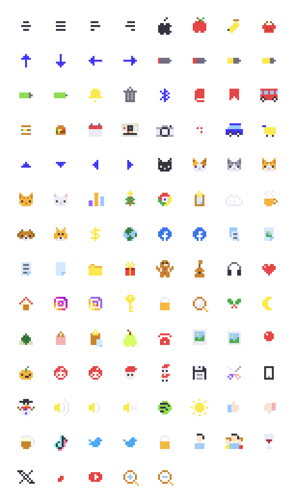

## Objects

| Image | File Name |
|-------|-----------|
| 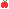 | apple.svg |
|  | apple-tree.svg |
| 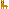 | alpaca.svg |
| 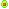 | avocado.svg |
| 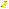 | banana.svg |
|  | basket.svg |
|  | bear.svg |
| 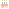 | birthday-cake.svg |
|  | book.svg |
|  | bookmark.svg |
|  | box.svg |
|  | bread.svg |
|  | broccoli.svg |
|  | brown-mushroom.svg |
|  | bubble-tea.svg |
|  | burger.svg |
|  | bus.svg |
|  | calendar.svg |
|  | california-roll.svg |
|  | camera-polaroid.svg |
|  | camera.svg |
|  | candycane.svg |
| 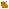 | capybara.svg |
| 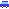 | car.svg |
| 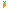 | carrot.svg |
|  | cart.svg |
|  | cat.svg |
|  | cat-sit.svg |
|  | cat-black.svg |
|  | cat-calico.svg |
| 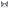 | cat-grey.svg |
|  | cat-orange.svg |
|  | cat-tabby.svg |
|  | cat-white.svg |
|  | christmas-tree.svg |
|  | clock.svg |
|  | cloud.svg |
|  | clownfish.svg |
| 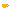 | coffee.svg |
|  | coffee-takeaway.svg |
|  | convertible.svg |
|  | cookie.svg |
|  | cow.svg |
| 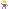 | dancing-man.svg |
| 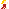 | dancing-woman.svg |
|  | device-computer.svg |
|  | device-smartphone.svg |
|  | device-tablet.svg |
|  | docker.svg |
| 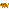 | dog.svg |
|  | dog-beagle.svg |
|  | dog-shiba.svg |
|  | dollar.svg |
|  | dolphin.svg |
|  | duck.svg |
| 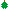 | durian.svg |
|  | earth.svg |
|  | egg.svg |
| 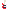 | electric-guitar.svg |
|  | elephant.svg |
|  | fish.svg |
|  | fox.svg |
|  | fries.svg |
|  | game-controller.svg |
| 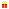 | gift.svg |
| 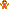 | gingerbread-man.svg |
|  | gua-bao.svg |
|  | guitar.svg |
| 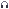 | headphones.svg |
|  | heart.svg |
| 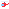 | helicopter.svg |
| 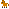 | horse.svg |
|  | house.svg |
| 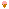 | ice-cream.svg |
|  | lu-rou-fan.svg |
|  | luggage.svg |
| 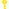 | key.svg |
|  | koala.svg |
|  | koala-hug.svg |
|  | lion.svg |
|  | light-bulb.svg |
|  | mailbox.svg |
| 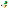 | mallard.svg |
|  | maneki-neko.svg |
| 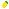 | mango.svg |
| 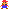 | mario.svg |
| 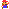 | mario-jump.svg |
|  | mirror-ball.svg |
| 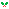 | mistletoe.svg |
| 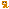 | monkey.svg |
| 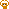 | monkey-love.svg |
|  | monkey-walk.svg |
|  | moon.svg |
|  | mount-fuji.svg |
|  | mushroom.svg |
|  | nasilemak.svg |
| 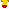 | noodles.svg |
|  | onigiri.svg |
|  | pancakes.svg |
|  | panda.svg |
|  | paper-bag.svg |
| 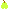 | pear.svg |
|  | pencil.svg |
|  | penguin.svg |
|  | phone.svg |
|  | photo.svg |
|  | picture.svg |
|  | pig.svg |
|  | pin.svg |
| 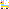 | pinata.svg |
| 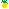 | pineapple.svg |
| 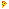 | pizza-slice.svg |
| 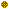 | pizza-whole.svg |
|  | plane.svg |
|  | pumpkin.svg |
| 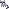 | raccoon.svg |
| 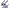 | rabbit-grey.svg |
|  | rabbit-white.svg |
| 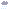 | rain.svg |
| 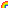 | rainbow.svg |
|  | ribbon.svg |
|  | rice.svg |
|  | robot.svg |
|  | rose.svg |
| 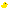 | rubber-duck.svg |
|  | rudolph.svg |
|  | sakura.svg |
|  | sakura-tree.svg |
|  | salmon-maki.svg |
|  | salmon-nigiri.svg |
|  | salmon-nigiri.svg |
|  | santa-face.svg |
| 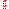 | santa.svg |
|  | ship.svg |
|  | shop.svg |
|  | shortcake.svg |
|  | siumai1.svg |
|  | siumai2.svg |
|  | siumai3.svg |
| 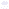 | snow.svg |
|  | snowman.svg |
|  | sparkles.svg |
|  | squirrel.svg |
|  | strawberry.svg |
|  | submarine.svg |
|  | sun.svg |
|  | sunglasses.svg |
|  | tamago-nigiri.svg |
|  | tang-yuan.svg |
|  | tapir.svg |
| 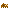 | tapir-baby.svg |
|  | tehtarik.svg |
|  | tomato.svg |
|  | truck.svg |
|  | truck-fast.svg |
|  | umbrella.svg |
| 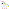 | unicorn.svg |
|  | xmas-bell.svg |
| 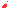 | xmas-stocking.svg |
| 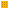 | waffle.svg |
|  | watermelon.svg |
|  | wine.svg |
|  | wombat.svg |
| 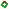 | wreath.svg |
|  | zongzi.svg |

## Brand Logos

| Image | File Name |
|-------|-----------|
|  | apple-logo.svg |
|  | chrome.svg |
|  | facebook.svg |
|  | facebook-detailed.svg |
|  | firefox.svg |
|  | github.svg |
|  | github-big.svg |
|  | instagram.svg |
|  | instagram-detailed.svg |
|  | internet-explorer.svg |
|  | microsoft-edge.svg |
|  | reddit.svg |
|  | reddit-detailed.svg |
|  | safari.svg |
|  | spotify.svg |
|  | tiktok.svg |
|  | x.svg |
|  | twitter.svg |
|  | twitter-detailed.svg |
|  | youtube.svg |

## Pokemons

| Image | File Name |
|-------|-----------|
| 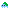 | bulbasaur.svg |
| 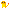 | charmander.svg |
|  | diglett.svg |
|  | eevee.svg |
|  | jigglypuff.svg |
|  | meowth.svg |
|  | pikachu.svg |
|  | psyduck.svg |
|  | squirtle.svg |

## Memes

| Image | File Name |
|-------|-----------|
|  | nyan-cat.svg |
|  | spooderman.svg |
|  | rickroll.svg |
|  | sacabambaspis.svg |
|  | sad-pepe.svg |
|  | stonks.svg |
|  | surprised-pikachu.svg |
|  | take-my-money.svg |
|  | this-is-fine.svg |

## UI

| Image | File Name |
|-------|-----------|
|  | align-center.svg |
|  | align-justify.svg |
|  | align-left.svg |
|  | align-right.svg |
|  | arrow-up.svg |
|  | arrow-down.svg |
|  | arrow-left.svg |
|  | arrow-right.svg |
|  | battery-1-6.svg |
|  | battery-2-6.svg |
|  | battery-3-6.svg |
|  | battery-4-6.svg |
|  | battery-5-6.svg |
|  | battery-6-6.svg |
|  | bell.svg |
|  | bin.svg |
|  | bluetooth.svg |
|  | burger-menu.svg |
|  | calculator.svg |
|  | caret-up.svg |
|  | caret-down.svg |
|  | caret-left.svg |
|  | caret-right.svg |
|  | chart.svg |
|  | clipboard.svg |
|  | control-panel.svg |
|  | copy.svg |
|  | edit.svg |
|  | export.svg |
|  | file-picture.svg |
|  | file-text.svg |
|  | file.svg |
|  | folder.svg |
|  | gear.svg |
|  | inbox.svg |
|  | outbox.svg |
|  | light-bulb-on.svg |
|  | light-bulb-off.svg |
|  | lock.svg |
|  | magnifier.svg |
|  | mail.svg |
|  | mail-open.svg |
|  | message.svg |
|  | message-typing.svg |
|  | messages.svg |
|  | microphone.svg |
|  | music.svg |
|  | paste.svg |
|  | printer.svg |
|  | save.svg |
|  | scissors.svg |
|  | star.svg |
|  | star-half.svg |
|  | star-empty.svg |
|  | sound-high.svg |
|  | sound-low.svg |
|  | sound-mute.svg |
|  | tiger.svg |
|  | tiger-walk.svg |
|  | thumb-up.svg |
|  | thumb-down.svg |
|  | unlock.svg |
|  | user.svg |
|  | users.svg |
|  | waze.svg |
|  | whale.svg |
|  | wifi.svg |
|  | wrench.svg |
|  | yacht.svg |
|  | zoom-in.svg |
|  | zoom-out.svg |

