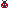
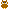
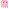

# Pixel Icons

This is a set of icons I made for fun. Feel free to use them as you please.

You may browse and filter the icons on [sqkhor.com/pixel-icons](https://sqkhor.com/pixel-icons).

To ease my workflow, all these icons were optimised with my tiny Python script [https://github.com/shuqikhor/optimise-pixels](optimise-pixels).

## Animals
\

## Fruits, Vegetables and other Ingredients
\

## Food and Drinks
\

## Objects
\

## Logos
\

## Games
\

## Pokemons
\

## Memes
\

## UI
\

